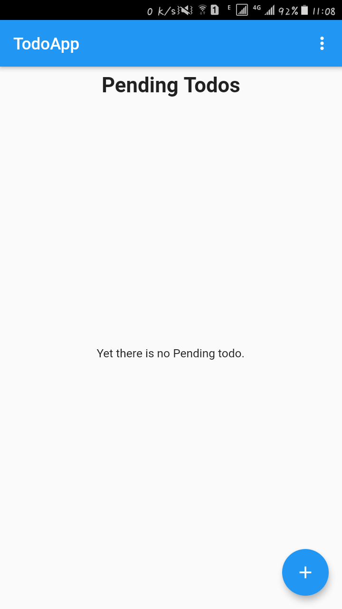
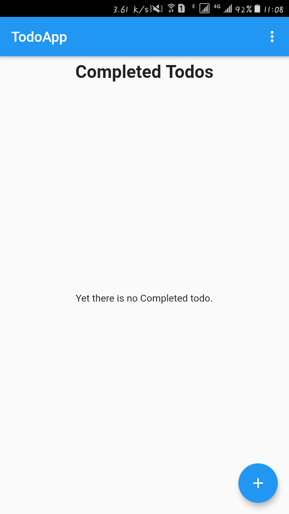
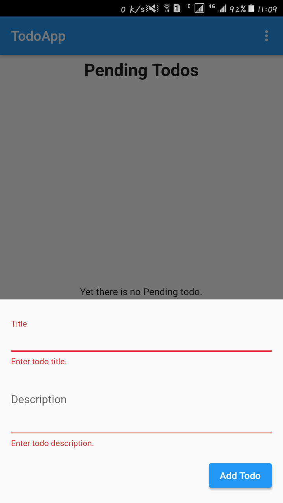

# todo_app

This is a simple todo app which is developed in flutter and dart.

## About

In this simple app user can add new todo. when he clicked on floating action button a new bottomModelSheet pop up which has form for user interaction. This form also have validation. He/She can delete any completed todo by just clicking on done icon button on the right side of each todo card. You can also see that in action by just clonning that project. And you can also get visual information by looking at the below mentioned pictures.

# Screenshots

## Chats Tab

## Status Tab

## Calls Tab

## Status Tab

## Calls Tab

